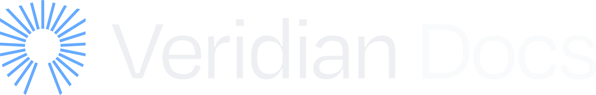

<div align="center">
   <picture>
      <source media="(prefers-color-scheme: dark)" srcset="utils/icons/VeridianDocsLogoDark.svg">
      <source media="(prefers-color-scheme: light)" srcset="utils/icons/VeridianDocsLogoLight.svg">
      
   </picture>

   <hr />
   <h1 align="center" style="border-bottom: none">Veridian Docs</h1>

   [![CC BY 4.0][cc-by-shield]][cc-by]
   
</div>

Welcome to the documentation site repository for the [Veridian platform](https://www.veridian.id/).
This site is generated using [Nextra](https://nextra.site/), a Next.js based static site generator.
Follow the instructions below to get started with the project.

## Getting Started

### Prerequisites

Ensure you have the following installed on your machine:

- [Node.js](https://nodejs.org/)
- [npm](https://www.npmjs.com/)

### Installation

1. Clone the repository:

   ```console
   git clone https://github.com/cardano-foundation/veridian-docs.git
   cd veridian-docs
   ```

2. Install the dependencies:
   ```console
   npm i
   ```

## Development

To start the development server, run the following command:

```console
npm run dev
```

This will start the server and you can view the site by navigating to http://localhost:3000 in your web browser.
The server supports hot reloading, so any changes you make to the files will automatically be reflected in the browser.

# Contributing

All contributions are welcome!
Please feel free to open a new thread on the issue tracker or submit a new pull request.

Please read [Contributing](CONTRIBUTING.md) in advance.
Thank you for contributing!

## Additional Documents
- [Code of Conduct](CODE_OF_CONDUCT.md)
- [Security](SECURITY.md)

## License

This work is licensed under a
[Creative Commons Attribution 4.0 International License][cc-by].

[![CC BY 4.0][cc-by-image]][cc-by]

[cc-by]: http://creativecommons.org/licenses/by/4.0/
[cc-by-image]: https://i.creativecommons.org/l/by/4.0/88x31.png
[cc-by-shield]: https://img.shields.io/badge/License-CC%20BY%204.0-lightgrey.svg